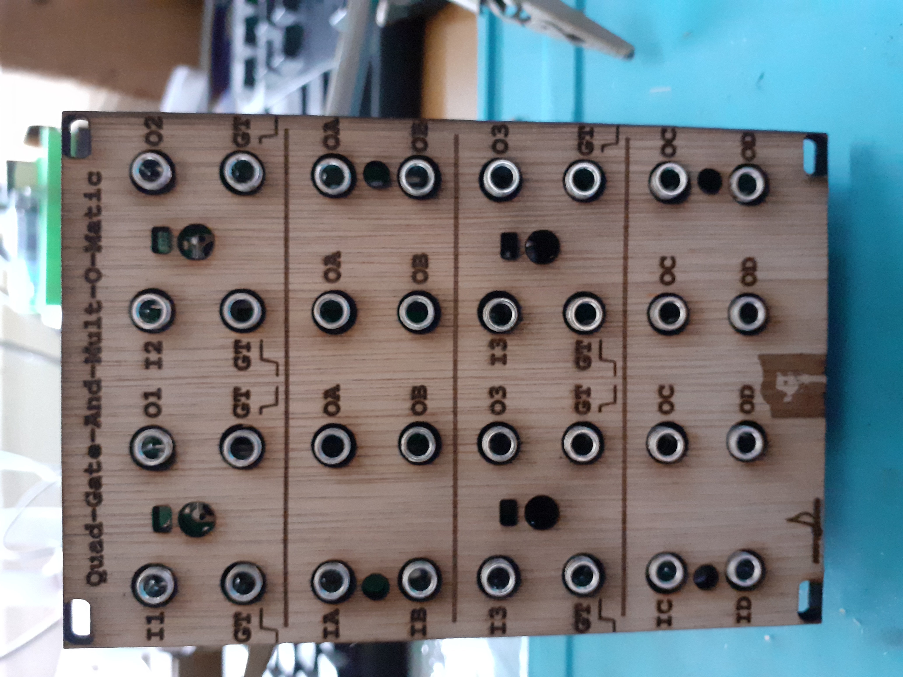

Sculpt-O-Sound presents: Quad-Switch-and-Mult-O-Matic 

The Quad-Switch-and-Mult-O-Matic is based on the Roland System 100 M173 module.
Instead of passive mults, this module has active mults, though.
The mults are normalized in groups of 2. IA is normalized to IB and IC is normalized to ID.
'normalized' means that e.g. IA is connected internally to IB via the switch in the 3.5 mm socket of IB. You can overrule the normalisation by inserting a patch cable with a signal into IB thus use the A and B mults separate from each other.
The GaTe inputs of the switches are also normalized, E.g. the rising edge GT-input of I1 is normalized to the rising edge GT-input of I2, I3 and I4. In a similar fashion the falling edge GT-input of I1 is normalized to the falling edge GT-input of I2, I3 and I4. So you can control all switches with one rising GT or one falling GT or control them all individually by patching control signals to their respective inputs.
